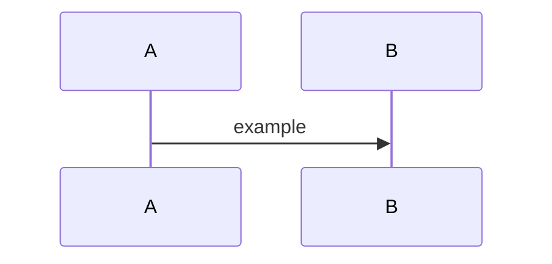

# Blog Notation Guide

This guide documents the supported notation and components for notes/blogs in
`src/content/notes/`. Keep syntax lightweight and consistent so styling stays
automatic.

## 1) Frontmatter (notes)

Notes live in `src/content/notes/` as `.md` or `.mdx` files and require the
schema below.

```yaml
---
title: "A short, specific title"
description: "1-2 lines that show up in previews."
publicationDate: 2026-01-04
image: ./cover.png # optional hero image (relative to this file)
imageAlt: "Concise alt text" # required if image is set
imageCaption: "Short caption shown under the hero image." # optional
tags:
  - rpc
  - infra
---
```

## 2) Inline formatting

- Inline code: use backticks, e.g. `` `eth_getBlockByNumber` ``.
- Inline math: use `$...$`, e.g. `$O(\log n)$`.
- Display math: use `$$...$$` on its own lines.

## 3) Code blocks (real code)

Use fenced code blocks with a language. This keeps the dark code style.

```ts
function hello() {
  return "world";
}
```

Use `text` for plain output or logs:

```text
curl https://example.com
```

## 4) Pseudocode blocks (algorithms)

Use the dedicated pseudocode fence. This renders as an inkprint-style algorithm.

```pseudocode
Algorithm InterpolationSearchTimestamp
Input: t*, b_min, b_max
Output: finalizeClosest(t*)
1:  L <- b_min
2:  R <- b_max
3:  while L <= R do
4:      ...
```

Alias: you can also use ` ```algorithm `.

Guidelines:
- Keep `Input:` / `Output:` on one line each.
- Number steps as `1:`, `2:`, etc.
- Use `//` for short inline comments.

## 5) Mermaid diagrams



Diagrams render automatically and can be clicked to open a larger preview.

## 6) Images

Inline images:

```md

```

Images in notes are clickable for a larger preview.

## 7) Embeds (iframes)

Any standalone URL containing `/embed`, `/embeds/`, or `?embed` is auto-embedded
and themed with the site. Put the link on its own line/paragraph:

```
https://dune.com/embeds/6439212/10236610?darkMode=true
```

Theme handling:
- If the URL uses `darkMode` or `theme`, the embed will update when the site
  toggles light/dark.

## 8) Link mentions

Bare URLs (no custom text) become a "link mention" chip with icon/host label:

```
https://docs.etherscan.io/api-reference/endpoint/getblocknobytime
```

If you want a normal link, wrap it with custom text:

```md
[Etherscan docs](https://docs.etherscan.io/api-reference/endpoint/getblocknobytime)
```

External links open in a new tab automatically for notes/projects pages.

## 9) Tables

Use standard Markdown tables:

```md
| Column | Value |
| --- | --- |
| A | 1 |
| B | 2 |
```

## 10) Interactive components (MDX)

Use MDX when you need interactive components. Import at the top:

```mdx
import SearchVisualizer from "@/components/SearchVisualizer.astro";
```

Then insert the component:

```mdx
<SearchVisualizer
  title="SIP/TIP under stress"
  description="Short caption here."
  algorithms={["interpolation", "sip", "tip"]}
  presets={["uniform", "piecewise"]}
  features={{ showWhyFails: true }}
  defaults={{ noise: 0.25 }}
/>
```

Keep the component props minimal and focused; use them only when needed.
