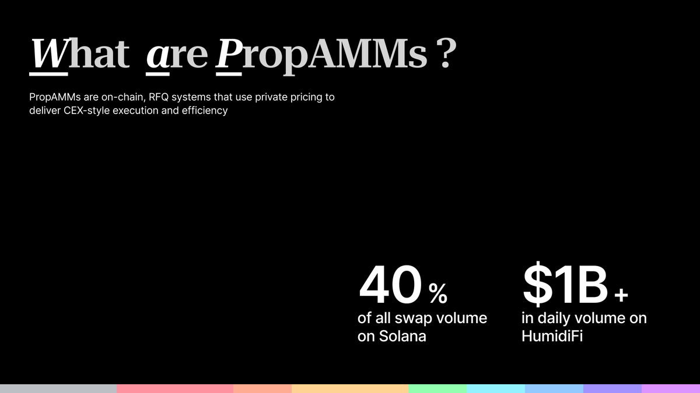
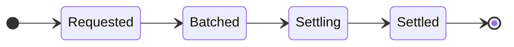
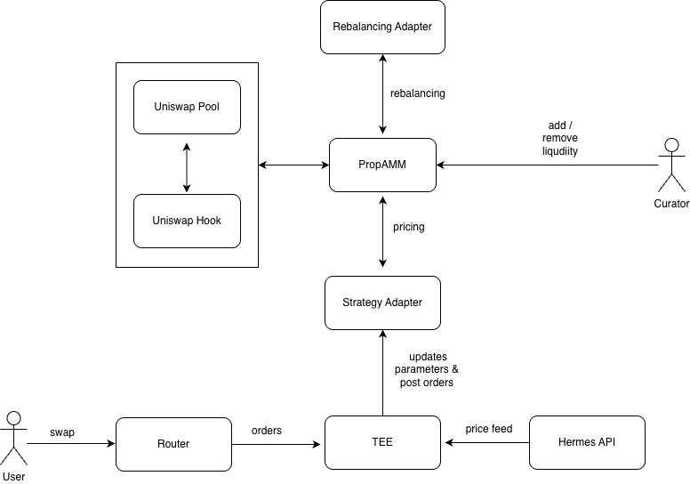
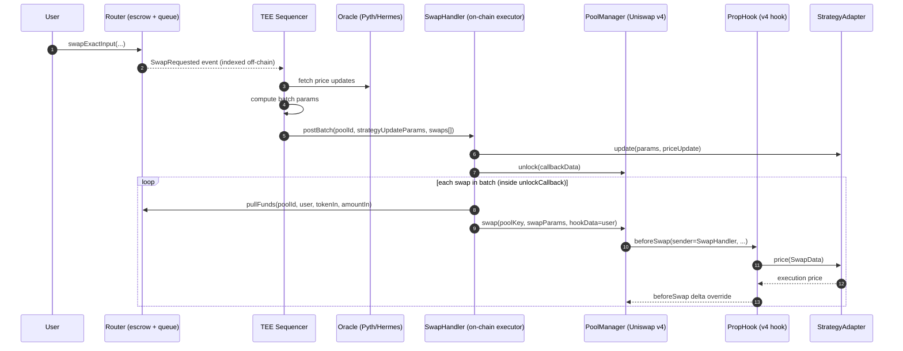

There’s a class of venues that market makers love on high-throughput chains: **single-maker, continuously refreshed liquidity**. They feel closer to a CEX than a constant-product AMM: spreads are tight, quotes update often, and execution quality is predictable.

On Ethereum, that style of venue is rare—not because it’s conceptually difficult, but because the EVM makes the workflow adversarial (public mempool, discrete blocks, and expensive updates).

**P.A.T (Proprietary AMM Launchpad)** is an experiment we built at **ETHGlobal Buenos Aires** to bridge that gap:

- keep **settlement + integration** on **Uniswap v4** (composable, transparent, permissionless-to-integrate)
- move **pricing computation** into a **TEE** (so strategies can remain private without giving up on-chain settlement)

## PropAMMs: on-chain RFQ, not “x\*y=k”

First, terminology.

Most AMMs we talk about on EVM are basically:

> “Here’s a deterministic pricing curve. Anyone can call it. Anyone can arbitrage it.”

PropAMMs flip that:

> “A single professional market maker controls the pricing function and inventory, updating quotes continuously based on risk and external price moves.”



This isn’t a constant-product AMM. It’s closer to an on-chain RFQ venue:

- tight spreads when inventory is balanced
- inventory-aware skew when risk increases
- frequent quote refreshes to avoid stale fills
- proprietary strategy logic (you generally don’t want to open-source your quoting engine)

### Why this fits Solana (and not the EVM)

On Solana, the constraints are friendly to fast updates:

- cheap state updates and fast cadence
- lower stale-quote risk
- less adverse selection from arbitrage “pickoff”

On EVM, the opposite is true:

- discrete blocks + gas auctions make rapid quote updates expensive
- public mempools make updates adversarial (you are broadcasting your intent)
- if your refresh doesn’t land first, you get picked off by arbitrage (stale-quote “pickoff”)

So the question we asked at ETHGlobal Buenos Aires (built with Eric Selvig + Sarthak Dengre) was:

> Can we keep _pricing logic_ private (so MMs can run real strategies), while keeping _execution + settlement_ on Uniswap v4 (so it stays transparent and composable)?

## Design goal: private pricing, public settlement

The core move is to split the swap into two phases:

1. **Request** (user intent goes on-chain)
2. **Settle** (actual swap happens later, atomically, via Uniswap v4)

In between, a **TEE sequencer** does the “pricing brain” work off-chain:

- batch incoming swap requests
- pull oracle updates (Pyth / Hermes)
- compute strategy parameters (spread/skew/inventory targets, etc.)
- submit a batch that settles atomically via v4’s unlock/callback flow

In one line:

```text
request: user -> router                 (escrow + SwapRequested event)
batch:              tee -> swapHandler  (postBatch: params + swaps[])
settle: swapHandler -> poolManager.swap (hook prices via adapter, settles atomically)
```

And as a minimal “request state machine”:



### System overview

This diagram captures the high-level architecture:



## Swap lifecycle: request → batch → settle

Here’s the execution flow in words:

1. A user submits a **swap request** to the `Router`. Funds are held in escrow and the request is emitted as an on-chain event.
   - If a request hasn’t been processed yet, the user can withdraw their escrowed funds from the router.
2. The **TEE sequencer** watches these events, aggregates them into a batch, pulls oracle data, and computes strategy parameters.
3. The sequencer calls `SwapHandler.postBatch(poolId, strategyUpdateParams, swaps[])`.
4. `SwapHandler` optionally updates the strategy adapter for the batch, then enters Uniswap v4’s **unlock/callback** flow.
5. Inside the unlock callback, `SwapHandler` pulls funds from the router, then calls `poolManager.swap(...)` for each request.
6. `PropHook.beforeSwap` runs during each swap (caller = `SwapHandler`), asks the strategy adapter for a price, and overrides execution deltas accordingly.

And here’s the same thing as a sequence diagram:



## Escrow semantics (and why they matter)

Async swaps live or die on UX and liveness.

In P.A.T, the router keeps an explicit ledger of user deposits (per pool and token). The sequencer can only execute a swap by having `SwapHandler` pull funds from the router, and users can withdraw if they don’t want to wait.

That “escape hatch” is important because TEEs don’t give you liveness for free. If the sequencer stalls, users should not be stranded.

## Components: what lives on-chain vs off-chain

One useful way to reason about P.A.T is as two layers:

- **Settlement layer (on-chain, deterministic)**: Uniswap v4 pool + hook + batch executor
- **Pricing layer (off-chain, private)**: the sequencer + strategy computation

Concrete pieces (names based on the repo):

- **`PropLaunchpad`**: deploys/configures new pools and wires adapters
- **`Router`**: accepts user requests, holds funds in escrow, emits events for off-chain indexing
- **`PropHook`**: Uniswap v4 hook that gates liquidity operations and delegates pricing to the strategy adapter during swaps
- **`SwapHandler`**: on-chain executor used for atomic batch settlement (posts batches, pulls funds, calls `poolManager.swap`)
- **Strategy adapters**: pricing logic via a small interface
- **Threshold adapters (optional)**: policy/rebalance hooks for risk controls (interface is present; wiring can be extended)
- **TEE sequencer**: watches events, pulls oracles, computes params, posts batches

## Why Uniswap v4 hooks are the right lever here

Uniswap v4 gives you two properties that are hard to replicate cleanly elsewhere:

1. **A composable settlement surface**: integrators still interact with a familiar pool abstraction.
2. **A programmable execution path**: hooks can intercept and override swap behavior without forking the whole AMM.

In P.A.T, the hook is effectively the “execution adapter”: swaps are no longer immediate curve evaluations; they become queued intents that later settle with hook-controlled deltas.

### Curated liquidity (by construction)

Prop venues are curated: the MM/curator is meant to own inventory and the quoting surface.

In this prototype, the hook rejects arbitrary add/remove liquidity calls, and the launchpad manages liquidity via explicit curator-controlled flows (including seeding the pool at creation time). This is intentional: it keeps the venue “single-maker” instead of turning into a public AMM with a fancy price function.

## Strategy adapters: the pricing brain is pluggable

Every pool is deployed with a **strategy adapter** that implements a tiny interface. Conceptually:

```solidity
interface IStrategyAdapter {
  function update(bytes calldata params, bytes[] calldata priceUpdate) external payable;
  function price(ISwapHandler.SwapData calldata swap) external returns (uint256);
  function parameters() external view returns (bytes memory);
}
```

- `update(...)` is called _once per batch_ to ingest fresh parameters and oracle data
- `price(...)` is called _during settlement_ to price each swap

So you can ship:

- a clean “reference strategy” (we did: an oracle-driven constant spread model using Pyth pull feeds)
- or your own proprietary adapter, as long as it speaks the interface

### Reference implementation: oracle mid + static spread

The reference adapter in the repo is `OracleStaticSpreadAdapter`:

- reads a Pyth price feed (with freshness constraints)
- stores parameters as a `bytes` blob (in the reference adapter: a spread in bps)
- only allows `update(...)` to be called by `SwapHandler` (i.e., by the TEE-authorized execution path)

Operationally, a batch contains two inputs:

1. **Strategy parameters** (e.g. spread/skew targets)
2. **Oracle update payload** (Pyth price update bytes)

The on-chain adapter updates the oracle price feed and commits the latest parameters, then `PropHook` calls `price(...)` per-swap during settlement.

This is the entire thesis in one line:

> Make the MM’s pricing logic modular, private-by-default, and still composable with v4 settlement.

## Threshold adapters: a safety rail (optional, but useful)

Prop venues are _curated_. Users are trusting a curator/MM to manage liquidity responsibly.

That’s why we added a second adapter hook: a **threshold system**.

```solidity
interface IThresholdAdapter {
  function rebalance(bytes calldata params) external;
  function theresholdReached(bytes calldata params) external returns (bool);
}
```

At a high level:

- the pool can check for “bad states” (ex: inventory drift, illiquidity, or policy violations)
- if a threshold is reached, it can trigger a curator-defined rebalance/fallback action

In the current prototype, the threshold adapter is part of the pool configuration and interface surface, but the “enforcement loop” is intentionally left extensible. Treat it as a circuit breaker hook for productionizing.

## The TEE trust model: what you get, what you trade off

TEEs are not magic; they’re a deliberate trade.

P.A.T uses a modular trust model:

- **On-chain contracts** are still deterministic and auditable.
- **Pricing computation** can remain private, but lives inside a TEE with remote attestation + policy gating.
- **Users** are explicitly opting into a curated venue (similar to choosing a specific RFQ/MM venue).

In our build, the sequencer runs in an **Intel TDX** TEE deployed on **Oasis Sapphire**, using **ROFL (Runtime Off-chain Logic)** for attestation/policy and secret provisioning.

What this buys you:

- the strategy can stay private (no “publish your quoting engine to the world” requirement)
- the chain still only accepts an **atomic settlement** that passes on-chain verification

What it does _not_ buy you:

- liveness guarantees (a sequencer can still go offline)
- censorship resistance by default (unless you add redundancy / multiple enclaves)
- immunity from TEE supply-chain and hardware trust assumptions

If you want the nitty-gritty, DeepWiki is genuinely great here:

- https://deepwiki.com/Suryansh-23/p.a.t/1-introduction
- https://deepwiki.com/Suryansh-23/p.a.t/2-architecture-overview

## Limitations and open questions

This was a hackathon prototype, so I’ll be explicit about the rough edges:

- **Latency UX**: async swaps introduce waiting time; production needs clear guarantees, expiries, and cancellation paths.
- **Sequencer liveness**: you want redundancy (multiple enclaves, failover policies, or a fallback executor).
- **Adversarial environments**: MEV still exists—your design needs to be honest about what’s protected (pricing logic) vs what remains public (settlement).
- **Trust posture**: TEEs are a tool, not a guarantee; your users need to understand the boundary.
  - In practice: publish an attestation policy, expose what’s private vs public, and be explicit about failure modes.

## Why this direction matters

PropAMMs feel like one of those “obviously useful, underrepresented” primitives on EVM:

- market makers get a venue that supports real quoting behavior
- integrators still get composability through v4 settlement
- users get execution that can look closer to professional venues (when the curator/MM does their job well)

If you want to dig deeper or build on this:

- Repo: https://github.com/Suryansh-23/p.a.t
- DeepWiki: https://deepwiki.com/Suryansh-23/p.a.t
- ETHGlobal: https://ethglobal.com/showcase/p-a-t-s0c42
- Post: https://x.com/SuriPuri23/status/2004931248566010145?s=20
